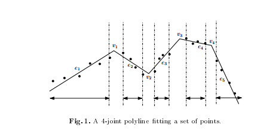

tags: 量化

# 线段处理

- [polyline Fitting of Planar Points under Min-Sum Criteria](http://www.jaist.ac.jp/~t-asano/C4240.pdf)

  

- [The Polygonal Line Algorithm](http://pca.narod.ru/5Ch5Keglthesis.pdf)

- [Ramer–Douglas–Peucker algorithm](https://en.wikipedia.org/wiki/Ramer%E2%80%93Douglas%E2%80%93Peucker_algorithm)
  

​        算法实现https://pypi.org/project/rdp/

